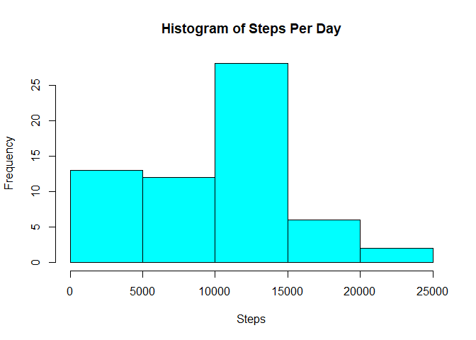
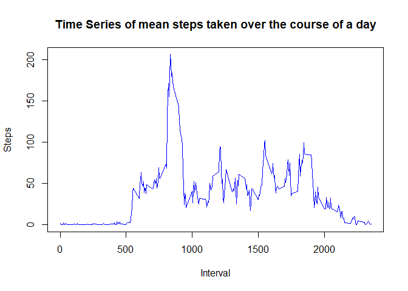
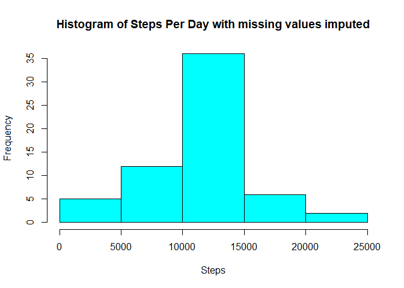
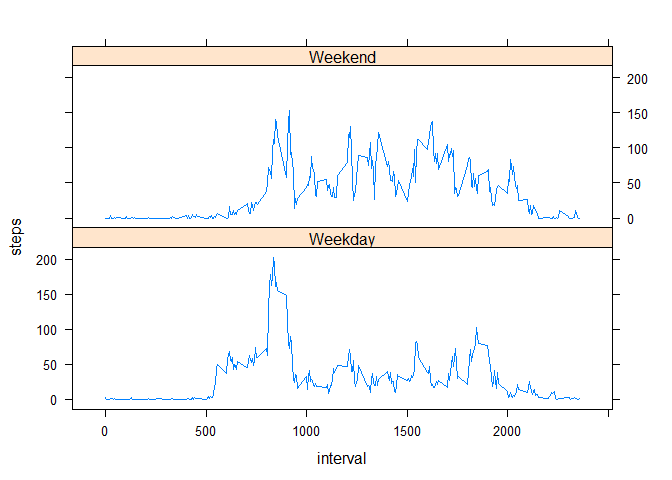

## Loading and preprocessing the data

We check to see if the `activity.csv` file exists already and if not we unzip the `activity.zip` file. We read in the data, making sure we include the header, and set the NA strings to be "NA". Finally, we convert the date column to be of the `date` class.


```r
if (!file.exists('activity.csv')){
        unzip("activity.zip", exdir = getwd())
}

data <- read.csv('activity.csv', header = TRUE, na.strings = "NA")

data$date <- as.Date(as.character(data$date), "%Y-%m-%d")
```


## What is mean total number of steps taken per day?

First, we summarise the data to take the sum of steps for each day using the `dplyr` package - we hide the loading in of `dplyr` as we do not need to see the result of this.


```r
steps_per_day <- data %>%
        group_by(date) %>%
        summarise(steps = sum(steps, na.rm = TRUE))
```

Let's take a look at a histogram of the total steps taken per day.


```r
hist(steps_per_day$steps, col="cyan", xlab="Steps", main="Histogram of Steps Per Day")
```

<!-- -->

And finally, let's calculate the mean and median of the total number of steps taken per day.


```r
mean(steps_per_day$steps)
```

```
## [1] 9354.23
```

```r
median(steps_per_day$steps)
```

```
## [1] 10395
```


## What is the average daily activity pattern?

Similar to above, we use the `dplyr` package to calculate the average number of steps taken in each time interval across all days.


```r
steps_per_interval <- data %>%
        group_by(interval) %>%
        summarise(steps = mean(steps, na.rm = TRUE))
```

Following this, let's create a time series plot of this data.


```r
with(steps_per_interval, plot(interval, steps, col = "blue", type = "l", xlab = "Interval", ylab= "Steps", main = "Time Series of mean steps taken over the course of a day"))
```

<!-- -->

Which time interval, averaged across all days, contains the maximum number of steps? Let's find out. We use the `which.max` function to find the index at which the maximum value can be found, then use this index to find the corresponding interval.


```r
max_int <- steps_per_interval$interval[which.max(steps_per_interval$steps)]
```

So the interval is...


```r
paste(max_int, max_int + 5, sep = " - ")
```

```
## [1] "835 - 840"
```


## Imputing missing values

There are a lot of missing (`NA`) values for the steps variable. But how many? Let's sum the `NA` values.


```r
sum(is.na(data$steps))
```

```
## [1] 2304
```

We fill in these missing values by using the average steps for the interval. We use the `head()` function to check there are no missing values.


```r
na_removed <- data # Copy the dataset to remove NA values
for (i in steps_per_interval$interval) {
        na_removed[na_removed$interval == i & is.na(na_removed$steps), ]$steps <- 
                steps_per_interval$steps[steps_per_interval$interval == i]
}
head(na_removed)
```

```
##       steps       date interval
## 1 1.7169811 2012-10-01        0
## 2 0.3396226 2012-10-01        5
## 3 0.1320755 2012-10-01       10
## 4 0.1509434 2012-10-01       15
## 5 0.0754717 2012-10-01       20
## 6 2.0943396 2012-10-01       25
```

Once again, let's take a look at a histogram of the total steps taken per day with these missing values set to the mean for that interva;. First we create the summarised data set like we did before.


```r
steps_per_day <- na_removed %>%
        group_by(date) %>%
        summarise(steps = sum(steps, na.rm = TRUE))
```

And we plot a histogram like we did before.


```r
hist(steps_per_day$steps, col="cyan", xlab="Steps", main="Histogram of Steps Per Day with missing values imputed")
```

<!-- -->

And finally, let's calculate the mean and median of the total number of steps taken per day.


```r
mean(steps_per_day$steps)
```

```
## [1] 10766.19
```

```r
median(steps_per_day$steps)
```

```
## [1] 10766.19
```

We can see there has been a slight change to the histogram, mean and median.

## Are there differences in activity patterns between weekdays and weekends?

First, we create a new `type_of_day` variable which indicates whether the day is in the week or on the weekend, then summarise the mean number of steps taken in each interval, split by weekend and weekday.


```r
weekdays <- na_removed %>%
        mutate(type_of_day = ifelse(weekdays(date) %in% c("Saturday", "Sunday"), "Weekend", "Weekday")) %>%
        group_by(interval,type_of_day) %>%
        summarise(steps = mean(steps))
```

```
## `summarise()` has grouped output by 'interval'. You can override using the `.groups` argument.
```

Now, we create a time series plot of this data, splitting the data between weekdays and weekends. Here, we use the `lattice` plotting system. We see there is quite an obvious difference in activity pattern depending on whether the day is in the week or on the weekend.


```r
library(lattice)
xyplot(steps ~ interval | type_of_day, data = weekdays, type = "l", layout=c(1,2))
```

<!-- -->
